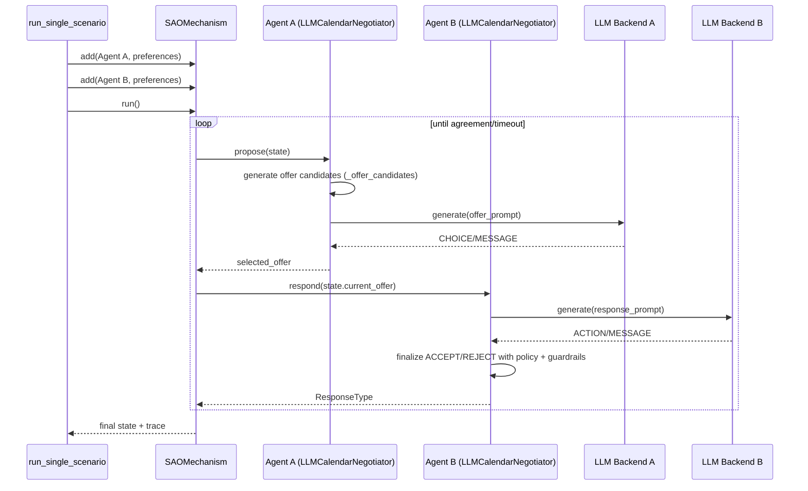
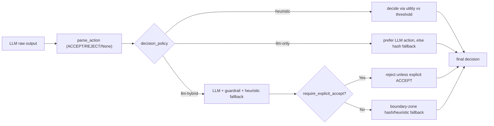
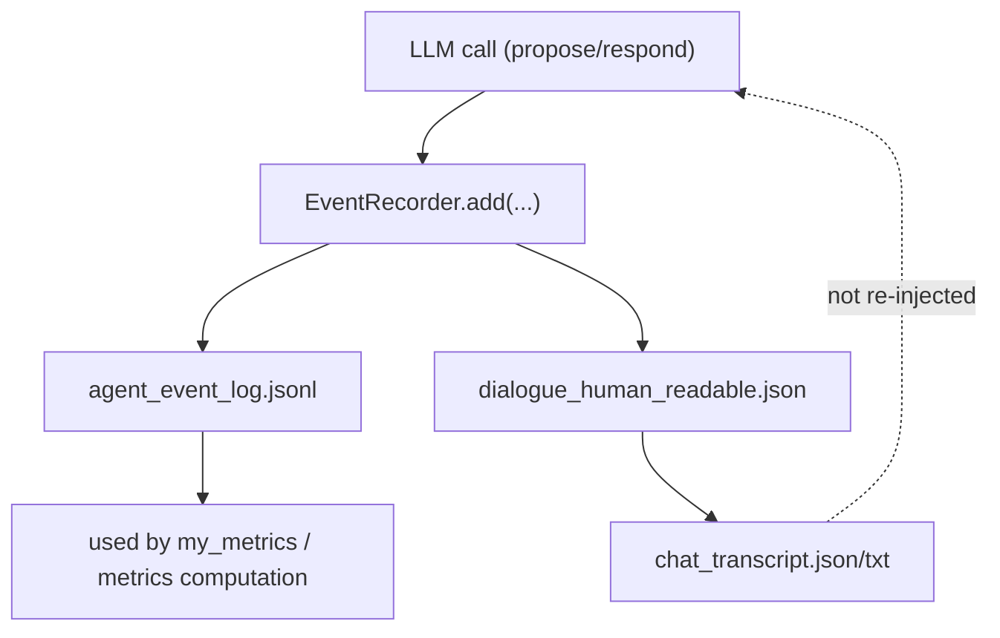

# Agent Message Processing in Negotiation

This document explains, based on the current implementation, which inputs each agent actually consumes to produce the next utterance, and how messages/offers circulate inside the negotiation engine (`negmas`).

## TL;DR

- Agents do **not** read the full natural-language chat history from the counterpart.
- Inputs directly used by an agent in LLM calls are mainly:
  - `state.step`, `state.relative_time`
  - `state.current_offer` (when responding)
  - Its own utility/threshold (`utility`, `threshold`)
  - Its own generated offer candidates (when proposing)
- In other words, the full sentence-level history of what the opponent said is not injected into prompts.
- `chat_transcript.json/txt` is for post-run reporting and is not re-injected into the next-turn model input.

## 1) Execution Structure (Engine Level)

Code references:
- Execution entry: `run_single_scenario()` in `src/runner.py`
- Negotiation engine: `SAOMechanism`
- Agent implementation: `LLMCalendarNegotiator` in `src/negotiation.py`

## 2) Inputs Actually Read by the Agent

### 2.1 At `propose()`

`propose()` in `src/negotiation.py` builds the prompt using only:

- `state.step`
- `state.relative_time`
- Its own aspiration threshold
- Its own candidate offers (`offer_candidates`) and each candidate's `utility_self`

Key prompt text includes:
- `"Current step: ... relative time: ..."`
- `"My current proposal threshold (aspiration): ..."`
- `"<idx>) offer=... | utility=..."`
- `"CHOICE: <number> / MESSAGE: <...>"`

So the full natural-language messages from earlier opponent turns are **not** included here.

### 2.2 At `respond()`

`respond()` in `src/negotiation.py` uses:

- `state.current_offer` (the offer tuple just proposed by the counterpart)
- `state.step`, `state.relative_time`
- Its own utility on that offer (`utility`)
- Its own acceptance threshold (`threshold`)

Key prompt text includes:
- `"Opponent offer: {...}"`
- `"My utility: ..."`
- `"Current acceptance threshold: ..."`
- `"ACTION: ACCEPT or REJECT / MESSAGE: ..."`

Again, the full natural-language history from previous opponent turns is **not** passed.

## 3) Precise Interpretation of "Does it read all opponent replies?"

In the current implementation, the agent reads:

- Engine state values (`step`, `relative_time`)
- The most recent offer (`current_offer`)
- Its own internal state (`preferences`, `reservation`, `concession`, `_offered`)

In the current implementation, the agent does not directly read:

- Full chat transcript text (`chat_transcript`)
- The list of opponent `message` texts from earlier turns
- Any summary memory or dialogue-history buffer

So the accurate statement is: **it reads opponent offers, but not the full natural-language dialogue history**.

## 4) Response Decision Logic (Post-processing after LLM Output)

In `respond()`, the raw LLM text is not immediately finalized as ACCEPT/REJECT.
It is post-processed according to `decision_policy` and `require_explicit_accept`.

Key points:
- With `require_explicit_accept=True`, agreement is hard to reach unless the LLM outputs explicit ACCEPT.
- Agreement is not decided by fluent wording alone; policy/parser outcomes are enforced.

## 5) Relationship Between Logs and Model Input

Logs are detailed, but logged text is not automatically re-injected into the next-turn prompt.

Generated logs:
- `agent_event_log.jsonl`: per-turn `llm_prompt`, `llm_raw_output`, `offer`, `decision`
- `negmas_trace.jsonl`: engine trace
- `chat_transcript.json/txt`: human-readable conversational output (generated post hoc)

## 6) Turn-level Data Passing Summary

| Stage | Key inputs directly visible to model | Not directly visible to model |
|---|---|---|
| propose | step, relative_time, aspiration, candidate offer list + utility | full dialogue-history text |
| respond | step, relative_time, current_offer, utility, threshold | full natural-language content of prior turns |
| post-processing | parsed action, utility, threshold, policy flags | none (code-level rule processing) |

## 7) If You Want It to Read Full Opponent Utterances

To extend while preserving the current structure:
- Insert summarized `message` content from the last N turns into `respond()` / `propose()` prompts
- Extract only opponent utterances from `EventRecorder.events` to build role-aware context
- To prevent token explosion:
  - Keep only last N turns + summarized key slots (destination/window/budget)
  - Maintain a separate compressed memory block for decision rationale

The current codebase does not have this memory injection stage.
