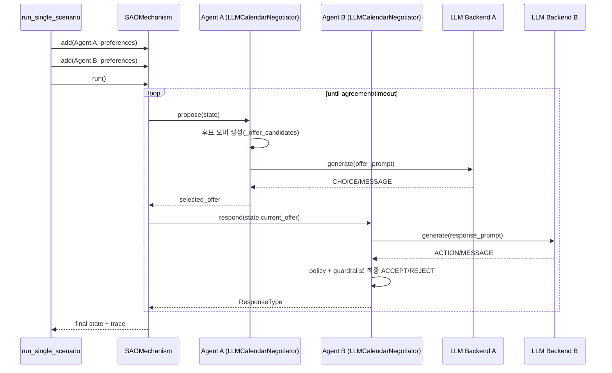
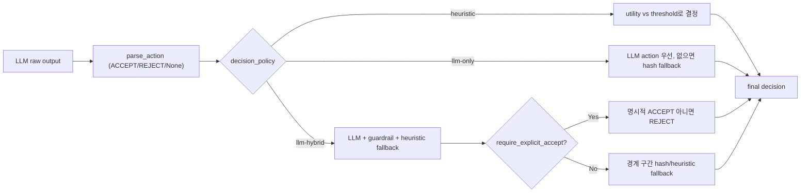
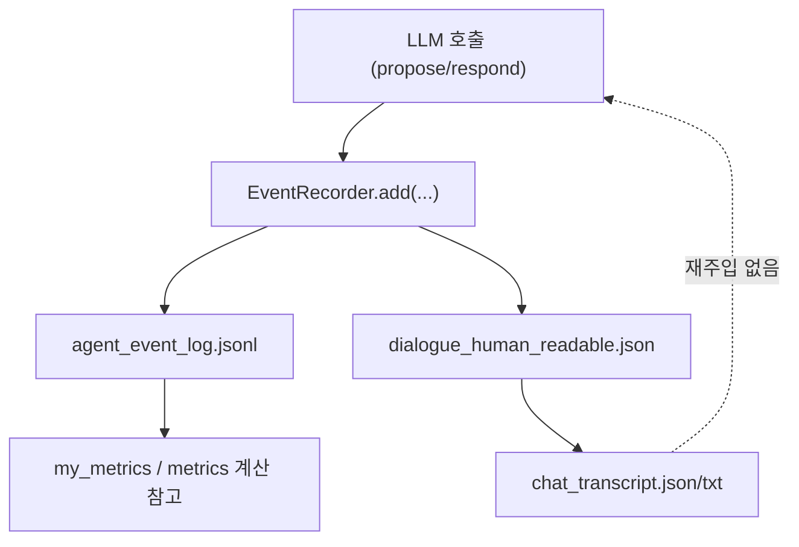

# Agent Message Processing in Negotiation

이 문서는 현재 코드 기준으로, 각 agent가 **무엇을 입력으로 받아** 다음 발화를 만드는지와,
협상 엔진(`negmas`) 안에서 메시지/오퍼가 어떻게 순환하는지 정리한다.

## TL;DR

- agent는 상대의 **자연어 전체 대화 로그를 읽지 않는다**.
- agent가 LLM 호출 시 직접 사용하는 입력은 주로:
  - `state.step`, `state.relative_time`
  - `state.current_offer` (응답 시)
  - 자신의 효용/임계값(`utility`, `threshold`)
  - 자신이 생성한 후보 오퍼 목록(제안 시)
- 즉, “상대가 직전에 말한 문장 전체 히스토리”는 프롬프트에 포함되지 않는다.
- `chat_transcript.json/txt`는 사후 리포트용이며, 다음 턴 모델 입력으로 재주입되지 않는다.

## 1) 실행 구조 (엔진 레벨)

코드 기준:
- 실행 진입: `run_single_scenario()` in `src/runner.py`
- 협상 엔진: `SAOMechanism`
- agent 구현: `LLMCalendarNegotiator` in `src/negotiation.py`

## 2) agent가 실제로 읽는 입력

### 2.1 propose() 시점

`src/negotiation.py`의 `propose()`는 아래 정보만으로 프롬프트를 구성한다.

- `state.step`
- `state.relative_time`
- 자신의 aspiration threshold
- 자신이 만든 후보 오퍼 `offer_candidates`와 각 후보의 `utility_self`

프롬프트에 들어가는 핵심 텍스트:
- `"현재 step: ... 상대시간: ..."`
- `"내 현재 제안 기준(aspiration): ..."`
- `"<idx>) offer=... | utility=..."`
- `"CHOICE: <번호> / MESSAGE: <...>"`

즉, **상대가 과거에 한 자연어 메시지 전체는 여기 들어가지 않는다**.

### 2.2 respond() 시점

`src/negotiation.py`의 `respond()`는 아래를 사용한다.

- `state.current_offer` (상대가 방금 제시한 오퍼 tuple)
- `state.step`, `state.relative_time`
- 해당 오퍼에 대한 자신의 효용 `utility`
- 자신의 수락 기준 `threshold`

프롬프트에 들어가는 핵심 텍스트:
- `"상대 제안: {...}"`
- `"내 효용: ..."`
- `"현재 수락 기준: ..."`
- `"ACTION: ACCEPT or REJECT / MESSAGE: ..."`

여기서도 **상대의 과거 자연어 히스토리 전체는 전달되지 않는다**.

## 3) “상대 답변을 다 읽는가?”에 대한 정확한 해석

현재 구현에서 agent는 아래를 읽는다.

- 엔진 상태값(`step`, `relative_time`)
- 직전 오퍼(`current_offer`)
- 자신의 내부 상태(`preferences`, `reservation`, `concession`, `_offered`)

현재 구현에서 agent는 아래를 직접 읽지 않는다.

- 전체 대화문(`chat_transcript`) 원문
- 이전 턴들의 상대 `message` 텍스트 목록
- 요약 메모리/대화 히스토리 버퍼

즉, **“상대 제안 오퍼는 읽지만, 상대 자연어 대화 전체는 읽지 않는다”**가 정확한 답이다.

## 4) 응답 결정 로직 (LLM 결과 후처리)

`respond()`에서 LLM raw 텍스트를 받은 뒤, 즉시 ACCEPT/REJECT로 확정하지 않는다.
`decision_policy`와 `require_explicit_accept`에 따라 후처리된다.

핵심:
- `require_explicit_accept=True`면, LLM이 명시적 ACCEPT를 주지 않으면 합의가 매우 어려워진다.
- 따라서 합의 판정은 “문장만 그럴듯”하다고 되지 않고, 정책/파서 결과를 거친다.

## 5) 로그와 모델 입력의 관계

기록은 상세하지만, 기록된 로그가 다시 다음 턴 프롬프트에 자동 주입되지는 않는다.

생성 로그:
- `agent_event_log.jsonl`: 턴별 `llm_prompt`, `llm_raw_output`, `offer`, `decision`
- `negmas_trace.jsonl`: 엔진 trace
- `chat_transcript.json/txt`: 사람이 읽기 쉬운 대화형 출력 (사후 생성)

## 6) 턴 단위 데이터 전달 요약

| 단계 | 모델이 직접 받는 핵심 입력 | 모델이 직접 못 보는 것 |
|---|---|---|
| propose | step, relative_time, aspiration, 후보 오퍼 리스트 + 효용 | 전체 대화 히스토리 텍스트 |
| respond | step, relative_time, current_offer, utility, threshold | 이전 턴들의 자연어 전체 |
| post-processing | parsed action, utility, threshold, policy flags | 없음(코드 규칙 처리) |

## 7) 만약 “상대 발화 전체를 읽게” 하려면

현재 구조를 유지하면서 확장하려면:
- `respond()`/`propose()` 프롬프트에 최근 N턴 `message`를 축약해 삽입
- `EventRecorder.events`에서 상대 발화만 추출해 role-aware context 구성
- 토큰 폭주를 막기 위해:
  - 최근 N턴 + 핵심 슬롯(destination/window/budget)만 요약
  - 결정 근거만 압축한 memory block 별도 유지

현재 코드에는 이 메모리 주입 단계가 없다.

